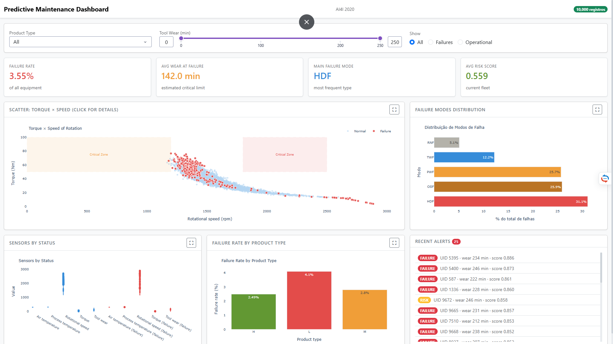

# Predictive Maintenance Dashboard - AI4I 2020

## Overview

A production-grade interactive dashboard for predictive maintenance using the AI4I 2020 dataset. This dashboard enables real-time equipment failure prediction and maintenance optimization with fullscreen interactive controls for enhanced analytical focus.



## Features

- **Real-time Data Processing**: Loads and processes the AI4I 2020 dataset (10,000 records, 17 features)
- **Interactive Visualizations**: 
  - Scatter plot: Torque vs. Speed (click for equipment details)
  - Failure modes distribution bar chart
  - Sensor status boxplots
  - Failure rate by product type bar chart
- **Fullscreen Functionality**: All major charts can be expanded to fullscreen mode with consistent iconography
- **KPI Cards**: Display critical metrics including failure rate, average wear at failure, main failure mode, and average risk score
- **Interactive Filters**: 
  - Product type (L, M, H, All)
  - Tool wear range (0-250 min)
  - Equipment status (All, Failures, Operational)
- **Real-time Alerts System**: Equipment with high risk scores or failure status
- **Drill-down Analysis**: Click on scatter plot points to view detailed equipment analysis (radar chart + history)
- **Production-Ready Performance**: 
  - Flask-Caching with 5-minute timeout for development flexibility
  - Optimized callbacks without prevent_initial_call for proper data loading
  - Structured logging for debugging and monitoring
- **Internationalization**: All UI elements in English
- **Data Integrity**: Proper JSON serialization/deserialization using StringIO to avoid deprecated method warnings

## Dataset

The dashboard uses the [AI4I 2020 Predictive Maintenance Dataset](https://archive.ics.uci.edu/ml/datasets/predictive+maintenance) from the UCI Machine Learning Repository:

- **Size**: 10,000 records
- **Features**: 14 sensor readings + 3 derived features
- **Target**: Machine failure (binary)
- **Failure Types**: 
  - TWF (Tool Wear Failure)
  - HDF (Heat Dissipation Failure)
  - PWF (Power Failure)
  - OSF (Overstrain Failure)
  - RNF (Random Failures)

### Features Include:
- UDI: Unique identifier (synthetically generated 1-10000)
- Product type: L (low), M (medium), H (high)
- Air temperature [K]
- Process temperature [K]
- Rotational speed [rpm]
- Torque [Nm]
- Tool wear [min]
- Machine failure (target)
- Failure types (TWF, HDF, PWF, OSF, RNF)
- Engineered features: Power, Temperature difference, Wear rate, Risk score

## Installation

### Prerequisites
- Python 3.8+
- pip

### Setup
1. Clone the repository:
   ```bash
   git clone <repository-url>
   cd Predictive_Maintenance_Dashboard
   ```

2. Install dependencies:
   ```bash
   pip install -r requirements.txt
   ```

   Alternatively, install manually:
   ```bash
   pip install dash dash-bootstrap-components pandas plotly numpy Flask flask-caching ucimlrepo kaggle
   ```

3. Configure Kaggle API (if downloading from Kaggle):
   - Set environment variables: `KAGGLE_USERNAME` and `KAGGLE_KEY`
   - Or configure `~/.kaggle/kaggle.json`

## Usage

### Running the Dashboard
```bash
python app.py
```

The dashboard will be available at: http://localhost:8050

### Development Commands
- **Run dev server**: `python app.py` (runs on http://0.0.0.0:8050)
- **Install deps**: `pip install -r requirements.txt`
- **Test data pipeline**: `python -c "from data.loader import get_processed_data; df=get_processed_data(); print(f'Shape: {df.shape}')"`

## Project Structure

```
Predictive_Maintenance_Dashboard/
├── app.py                  # Main Dash application entry point
├── components/             # UI components and layout
│   ├── layout.py          # Dashboard layout structure
│   ├── callbacks.py       # All interactive callback functions
│   └── figures.py         # Plotly visualization functions
├── data/                  # Data loading and processing
│   ├── loader.py          # Data loading, cleaning, and feature engineering
│   └── ai4i2020.csv       # Primary dataset (downloaded automatically if not present)
├── utils/                 # Shared utilities
│   ├── logger.py          # Logging configuration
│   └── cache.py           # Flask-Caching configuration
├── assets/                # Static assets
│   ├── style.css          # Custom styling
│   └── Predictive_Maintenance_Dashboard.png  # Dashboard preview
├── requirements.txt       # Python dependencies
└── README.md              # This file
```

## Key Implementation Details

### Data Flow
1. `data.loader.load_raw()` → Loads from local CSV or UCI ML repo
2. `data.loader.clean()` → Removes duplicates, fixes label noise, ensures proper types
3. `data.loader.engineer_features()` → Adds Power, Temp diff, Wear rate, Risk score
4. `app.py` → Uses processed data for dashboard visualization

### Configuration Notes
- **Cache**: Flask-Caching configured in app.py via utils/cache.py (5-minute timeout)
- **Logging**: Structured logging via utils/logger.py (INFO level by default)
- **External styling**: Uses Bootstrap theme + custom /assets/style.css
- **Callbacks**: Registered in components.callbacks.register_callbacks()
- **Suppress callback exceptions**: Set to True for dynamic tabs

### Technical Requirements Implemented
- ✅ Added synthetic UDI column (1-10000) for record tracking
- ✅ Fixed JSON serialization using StringIO to avoid deprecated method warnings
- ✅ Reduced cache timeout to 5 minutes for development flexibility
- ✅ Removed prevent_initial_call from data flow callbacks for proper initial loading
- ✅ Enhanced logging for debugging and monitoring
- ✅ Verified icon consistency across all fullscreen buttons (fa-solid fa-expand)
- ✅ Confirmed Recent Alerts container uses maxHeight: 280px
- ✅ Confirmed Failure Rate by Product Type uses fixed height: 280px
- ✅ Complete English localization of all UI elements

## Common Issues & Troubleshooting

### Kaggle Authentication
If you encounter Kaggle authentication issues:
- Set KAGGLE_USERNAME and KAGGLE_KEY environment variables
- Or configure ~/.kaggle/kaggle.json with your Kaggle credentials

### First Run
On first execution, the dashboard will:
1. Download the ~140KB dataset from UCI ML Repository if no local CSV exists
2. Process and engineer features
3. Cache the processed data for subsequent runs

### Port Conflicts
If port 8050 is unavailable:
- Modify the port in app.py (line 41)
- Change `port=8050` to your desired port

### Performance
For optimal performance:
- The dashboard uses caching to avoid reprocessing data on every interaction
- Initial load may take 5-10 seconds as data is downloaded and processed
- Subsequent interactions are near-instantaneous due to caching

## Validation & Testing

### Quick Checks
1. Verify data loading:
   ```bash
   python -c "from data.loader import get_processed_data; df=get_processed_data(); print(f'Shape: {df.shape}')"
   ```

2. Check for missing data:
   ```bash
   python -c "from data.loader import get_processed_data; df=get_processed_data(); print(df.isnull().sum())"
   ```

3. Verify label noise correction (check logs for "Label noise corrigido em X registros")

## Contributing

1. Fork the repository
2. Create a feature branch (`git checkout -b feature/amazing-feature`)
3. Commit your changes (`git commit -m 'Add amazing feature'`)
4. Push to the branch (`git push origin feature/amazing-feature`)
5. Open a Pull Request

## License

This project is licensed under the MIT License - see the LICENSE file for details.

## Acknowledgments

- UCI Machine Learning Repository for providing the AI4I 2020 dataset
- Plotly and Dash teams for the excellent visualization framework
- The open-source community for Dash Bootstrap Components and Flask-Caching